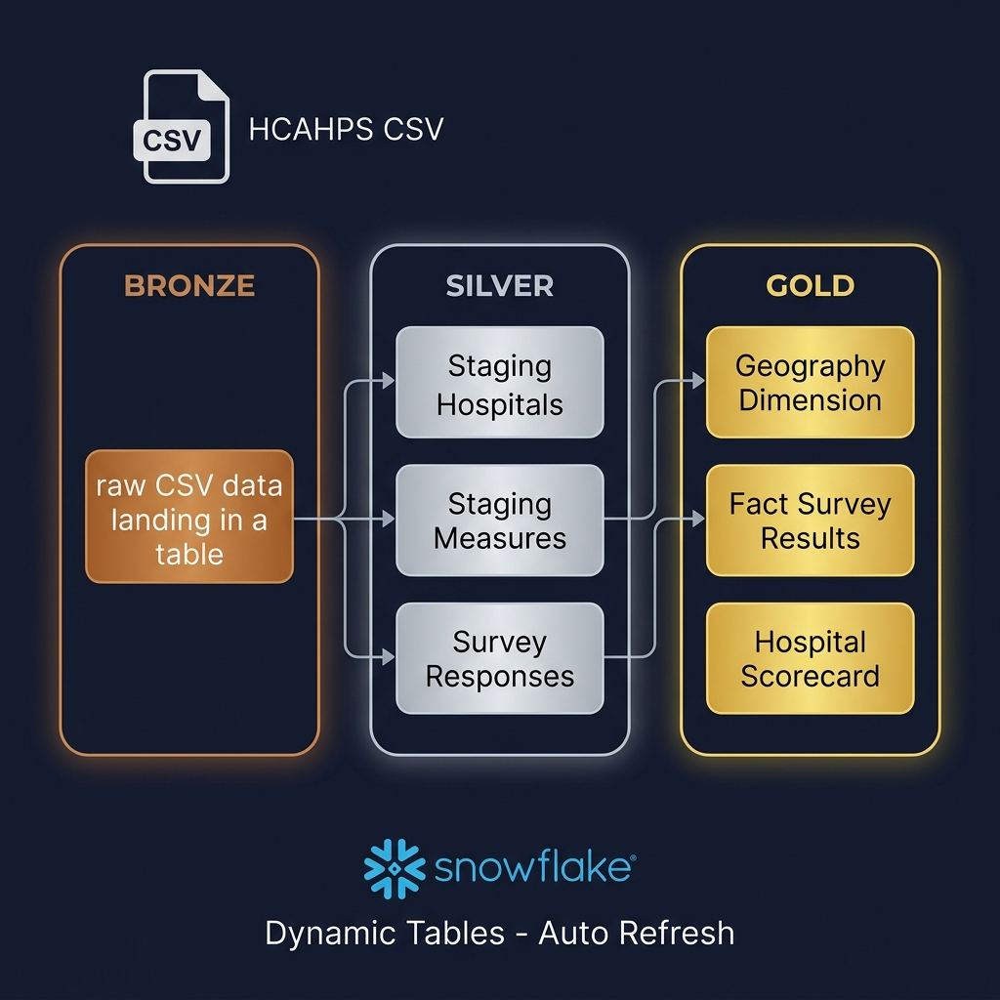
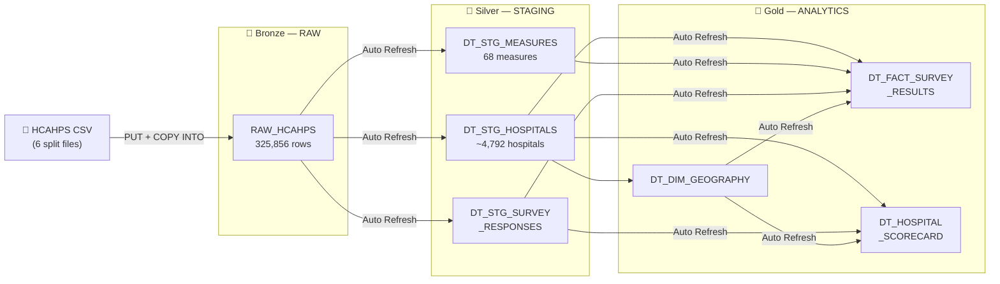
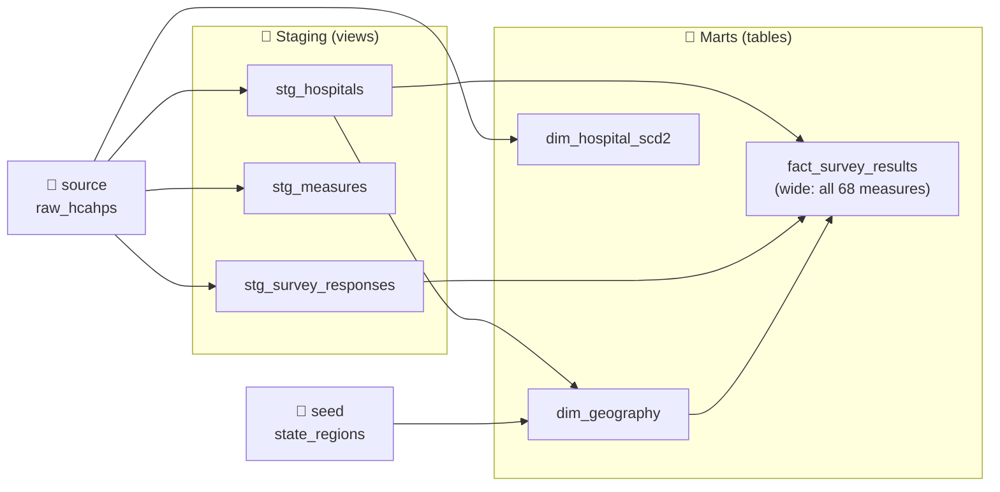

<p align="center">
  
</p>

<h1 align="center">🏥 HCAHPS Hospital Survey — Snowflake ELT Pipeline</h1>

<p align="center">
  <strong>End-to-end data engineering pipeline using Snowflake Dynamic Tables</strong><br/>
  Automated Bronze → Silver → Gold medallion architecture with incremental loading
</p>

<p align="center">
  
  
  
  
</p>

---

## 📋 Project Overview

This project builds a **fully automated ELT pipeline** that transforms raw CMS hospital patient survey data (HCAHPS) into analytics-ready tables using **Snowflake Dynamic Tables** — Snowflake's modern, declarative approach to data transformation.

### What is HCAHPS?

**HCAHPS** (Hospital Consumer Assessment of Healthcare Providers and Systems) is the first national, publicly reported survey of patients' perspectives of hospital care. CMS requires all IPPS hospitals to participate.

### Key Metrics

| Metric | Value |
|--------|-------|
| **Total Records** | 325,856 |
| **Hospitals** | 4,792 |
| **US States/Territories** | 56 |
| **Survey Measures** | 68 across 10 domains |
| **Survey Period** | Jul 2024 – Jun 2025 |

---

## 🏗️ Architecture

### Pipeline Design

```
┌─────────────┐     ┌──────────────────────────────────────────────────────────┐
│             │     │              SNOWFLAKE (Automated Pipeline)              │
│  HCAHPS     │     │                                                          │
│  CSV Files  │────▶│  🥉 BRONZE          🥈 SILVER           🥇 GOLD         │
│  (Split     │     │  ┌────────────┐     ┌──────────────┐   ┌─────────────┐  │
│   into 6    │     │  │ RAW_HCAHPS │────▶│ DT_STG_      │──▶│ DT_FACT_    │  │
│   files)    │     │  │ (landing)  │     │  HOSPITALS   │   │  SURVEY_    │  │
│             │     │  │            │     │  MEASURES    │   │  RESULTS    │  │
│  PUT +      │     │  │ COPY INTO  │     │  SURVEY_     │   │ DT_HOSPITAL │  │
│  COPY INTO  │     │  │            │     │  RESPONSES   │   │  SCORECARD  │  │
│             │     │  └────────────┘     └──────────────┘   │ DT_DIM_     │  │
│             │     │                                         │  GEOGRAPHY  │  │
│             │     │                                         └─────────────┘  │
│             │     │  ⚡ Dynamic Tables auto-refresh within 5 minutes         │
└─────────────┘     └──────────────────────────────────────────────────────────┘
```

### Data Flow Diagram



### Why Dynamic Tables? (vs Streams + Tasks + MERGE)

| Aspect | Old Way (Streams+Tasks+MERGE) | This Project (Dynamic Tables) |
|--------|-------------------------------|-------------------------------|
| **Objects to create** | 12+ (streams, tasks, procedures, merges) | **6 dynamic tables** |
| **Lines of SQL** | ~300 lines | **~80 lines** |
| **Scheduling** | You manage (CRON, task chains) | `TARGET_LAG = '5 minutes'` |
| **Incremental logic** | Write MERGE with WHEN MATCHED/NOT MATCHED | **Automatic** |
| **Dependencies** | Manual `AFTER` clauses | `DOWNSTREAM` — auto-detected |
| **Deduplication** | Complex MERGE | `QUALIFY ROW_NUMBER()` |

---

## 🛠️ Tech Stack

| Technology | Purpose |
|-----------|---------|
| **Snowflake** | Cloud data warehouse |
| **Dynamic Tables** | Declarative, auto-refreshing transformations |
| **QUALIFY + ROW_NUMBER** | Deduplication without MERGE |
| **LEAD()** | SCD Type 2 history tracking |
| **TRY_CAST / TRY_TO_DATE** | Safe type conversion |
| **MD5()** | Surrogate key generation |
| **Medallion Architecture** | Bronze → Silver → Gold layering |

---

## 📁 Project Structure

```
hcahps-snowflake-pipeline/
├── README.md                                    # This file
├── .gitignore
├── snowflake/                                   # Raw SQL scripts (Dynamic Tables)
│   ├── 01_setup_infrastructure.sql              # Database, schemas, stage, raw table
│   ├── 02_create_dynamic_tables_staging.sql     # Silver: 3 staging dynamic tables
│   ├── 03_create_dynamic_tables_analytics.sql   # Gold: fact, scorecard, geography
│   ├── 04_load_data_and_test.sql                # Load split files & verify pipeline
│   ├── 05_monitoring_queries.sql                # Pipeline health checks & analytics
│   └── 06_scd2_dynamic_table.sql                # Bonus: SCD Type 2 with LEAD()
├── dbt/                                         # dbt project (alternative approach)
│   ├── dbt_project.yml                          # Project configuration
│   ├── profiles.yml                             # Snowflake connection
│   ├── packages.yml                             # dbt packages (dbt_utils)
│   ├── models/
│   │   ├── staging/                             # 🥈 Silver Layer (views)
│   │   │   ├── sources.yml
│   │   │   ├── schema.yml
│   │   │   ├── stg_hospitals.sql
│   │   │   ├── stg_measures.sql
│   │   │   └── stg_survey_responses.sql
│   │   └── marts/                               # 🥇 Gold Layer (tables)
│   │       ├── schema.yml
│   │       ├── dim_geography.sql
│   │       ├── dim_hospital_scd2.sql
│   │       └── fact_survey_results.sql
│   ├── seeds/state_regions.csv
│   ├── tests/
│   ├── macros/
│   ├── snapshots/
│   └── analyses/
├── data/
│   └── split_data/                              # 6 CSV files for incremental testing
└── docs/
    ├── pipeline_architecture.png                # Architecture diagram
    └── data_dictionary.md                       # Column definitions & domains
```

---

## 🔄 dbt Project

This repo includes a **full dbt project** (`dbt/`) as an alternative transformation approach. While the `snowflake/` directory uses raw SQL with Dynamic Tables, the `dbt/` directory implements the same Bronze → Silver → Gold pipeline using dbt's modular, testable, and version-controlled framework.

### dbt DAG



### Quick Start

```bash
cd dbt/
export SNOWFLAKE_ACCOUNT="your-account"
export SNOWFLAKE_USER="your-user"
export SNOWFLAKE_PASSWORD="your-password"

pip install dbt-snowflake
dbt deps       # Install packages
dbt seed       # Load state_regions lookup
dbt run        # Build all models
dbt test       # Run all tests
dbt docs generate && dbt docs serve  # View documentation
```

See [`dbt/README.md`](dbt/README.md) for full details.

---

## 🚀 Quick Start

### Prerequisites

- [Snowflake Account](https://signup.snowflake.com/) (free trial with $400 credit)
- SnowSQL CLI or Snowflake Web UI (Snowsight)

### Step 1: Setup Infrastructure

Run [01_setup_infrastructure.sql](snowflake/01_setup_infrastructure.sql) in your Snowflake worksheet:

```sql
-- Creates: Database, 3 Schemas, Warehouse, Stage, File Format, Raw Table, Lookup Table
```

### Step 2: Create Staging Dynamic Tables

Run [02_create_dynamic_tables_staging.sql](snowflake/02_create_dynamic_tables_staging.sql):

```sql
-- Creates 3 Dynamic Tables in STAGING schema:
-- DT_STG_HOSPITALS       → Deduplicated hospitals (QUALIFY ROW_NUMBER)
-- DT_STG_MEASURES        → 68 measures with domain classification
-- DT_STG_SURVEY_RESPONSES → Cleaned, type-cast survey data
```

### Step 3: Create Analytics Dynamic Tables

Run [03_create_dynamic_tables_analytics.sql](snowflake/03_create_dynamic_tables_analytics.sql):

```sql
-- Creates 3 Dynamic Tables in ANALYTICS schema:
-- DT_DIM_GEOGRAPHY        → State + region dimension
-- DT_FACT_SURVEY_RESULTS  → Star schema fact table
-- DT_HOSPITAL_SCORECARD   → Pivoted 1-row-per-hospital summary
```

### Step 4: Load Data & Test Pipeline

Run [04_load_data_and_test.sql](snowflake/04_load_data_and_test.sql):

```sql
-- Upload initial_load.csv (50 MB) → verify pipeline auto-refreshes
-- Upload incremental files 1-5 → verify counts grow correctly
-- Final verification: 325,856 rows across all layers
```

### Expected Row Counts After Each Load

| After Loading | RAW Rows | Scorecard Hospitals |
|--------------|----------|---------------------|
| `initial_load` | 162,928 | ~2,400 |
| + `incremental_1` | 195,513 | ~2,900 |
| + `incremental_2` | 228,098 | ~3,350 |
| + `incremental_3` | 260,683 | ~3,800 |
| + `incremental_4` | 293,268 | ~4,300 |
| + `incremental_5` | **325,856** | **~4,792** ✅ |

---

## 📊 Sample Analytics

### Top 5-Star Hospitals

```sql
SELECT facility_name, city, state, region,
       nurse_comm_always_pct, doctor_comm_always_pct,
       recommend_definitely_pct
FROM HCAHPS_DW.ANALYTICS.DT_HOSPITAL_SCORECARD
WHERE overall_star_rating = 5
ORDER BY recommend_definitely_pct DESC
LIMIT 10;
```

### Average Scores by Region

```sql
SELECT region, COUNT(*) AS hospitals,
       ROUND(AVG(overall_star_rating), 2) AS avg_stars,
       ROUND(AVG(nurse_comm_always_pct), 1) AS avg_nurse_pct,
       ROUND(AVG(recommend_definitely_pct), 1) AS avg_recommend_pct
FROM HCAHPS_DW.ANALYTICS.DT_HOSPITAL_SCORECARD
WHERE overall_star_rating IS NOT NULL
GROUP BY region ORDER BY avg_stars DESC;
```

### Pipeline Health Check

```sql
SELECT NAME, SCHEDULING_STATE, TARGET_LAG,
       DATEDIFF('minute', DATA_TIMESTAMP, CURRENT_TIMESTAMP()) AS lag_minutes
FROM TABLE(INFORMATION_SCHEMA.DYNAMIC_TABLES())
ORDER BY NAME;
```

---

## 🔄 SCD Type 2 (Bonus)

The project includes an [SCD Type 2 dynamic table](snowflake/06_scd2_dynamic_table.sql) that tracks hospital changes over time using `LEAD()` window functions — **no Streams, Tasks, or MERGE required**.

```sql
-- Automatically tracks when a hospital changes name/address:
-- ┌──────────┬──────────────────────┬────────────┬────────────┬─────────┐
-- │ facility │ name                 │ valid_from │ valid_to   │ current │
-- ├──────────┼──────────────────────┼────────────┼────────────┼─────────┤
-- │ 010001   │ Old Hospital Name    │ 2024-01-01 │ 2025-06-15 │ false   │
-- │ 010001   │ New Hospital Name    │ 2025-06-15 │ 9999-12-31 │ true    │
-- └──────────┴──────────────────────┴────────────┴────────────┴─────────┘
```

---

## 📊 Survey Domains

| Domain | Measures | Example Question |
|--------|----------|-----------------|
| 🏥 Nurse Communication | 7 | "Nurses always communicated well" |
| 👨‍⚕️ Doctor Communication | 7 | "Doctors always listened carefully" |
| ⏱️ Staff Responsiveness | 4 | "Always received help as soon as wanted" |
| 💊 Medicine Communication | 7 | "Always explained medicines before giving" |
| 📋 Discharge Information | 4 | "Given information about recovery at home" |
| 🧹 Cleanliness | 4 | "Room was always clean" |
| 🤫 Quietness | 4 | "Area around room was always quiet at night" |
| ⭐ Overall Rating | 4 | "Gave hospital a rating of 9 or 10" |
| 👍 Recommendation | 4 | "Would definitely recommend hospital" |
| 🌟 Overall Star Rating | 1 | Composite 1–5 star summary |

---

## 📝 Data Source

- **Provider:** Centers for Medicare & Medicaid Services (CMS)
- **Dataset:** HCAHPS Hospital Survey
- **URL:** [data.cms.gov](https://data.cms.gov/provider-data/topics/hospitals)
- **Refresh Frequency:** Quarterly
- **License:** Public Domain (US Government)

---

## 📄 License

This project is open source and available under the [MIT License](LICENSE).

---

<p align="center">
  Built with ❄️ Snowflake Dynamic Tables
</p>
